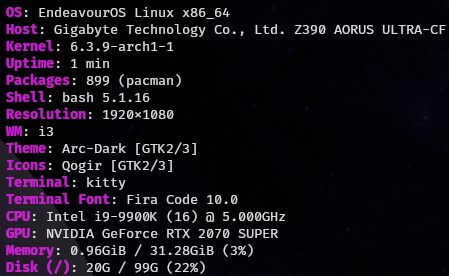
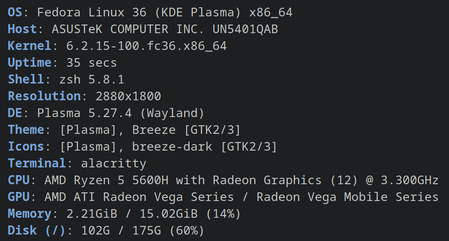
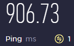

# Hi! 👋🏼

I'm a passionate computer polyglot 👨🏼‍💻 (at the moment mostly full-stack) from 🇵🇱\
that loves everything tech, IT, ICT and programming related!

## 🛠 Working on

- A couple *top secret* side projects 😎
- My portfolio website
- Writing articles

<!--
## 📚 Learning

- Docker 🐳
- Vue
-->

## 📈 Stats

  
  

## 💻 How I work

  
   
  /
     
  
   
  +
     
  
   
  +
   
  
  
  
  
  
  
  
  
  
  
  
  
  
  
  
  
  
  
  
  
  
  
  
  
  
  
  
  
  
  
  
  
  
  
  
  
  
  

## 👷🏻‍♂️ Proud contributor

  
  

<!--
## 📝 Blog posts (hopefully I'll get to writing soon 😅)

  

-->
## 🌐 Socials

  
  
  
  
  
   
  

## 📞 Reach me

- ✉ <a href="mailto:contact@erykdarnowski.pl">contact@erykdarnowski.pl</a>
- 👔 <a href="https://www.erykdarnowski.pl">Portfolio</a>

## ⚡Fun facts

- I use Neovim 😱
- I use Arch btw 🐧
- I know how to solve a few Rubik's cubes (2x2 ; 3x3 and 4x4) 🧊
- [My speed typing PB (peak) is ~`193`WPM / ~`965`CPM (QWERTY on monkeytype in English) ⌨️](https://monkeytype.com/profile/JS_Programmer)
<!--
- A couple years back I was trying out Unreal Engine 4 and thing is you needed to create an Epic account in order to use it. I did that with the username `Eryk` and though nothing of it. A few years go by, Epic releases the Epic Launcher, later Fortnite and now I have over 800 friend requests on there 🤯 (presumably because of my unusual username). 😅
-->

---

  

